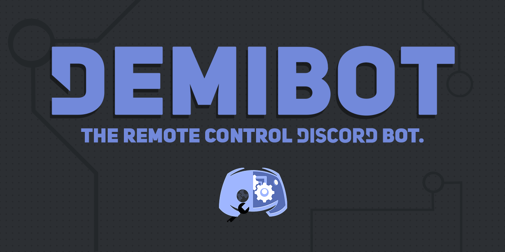
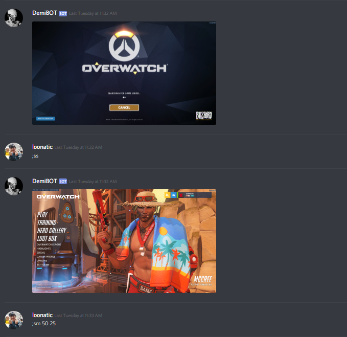
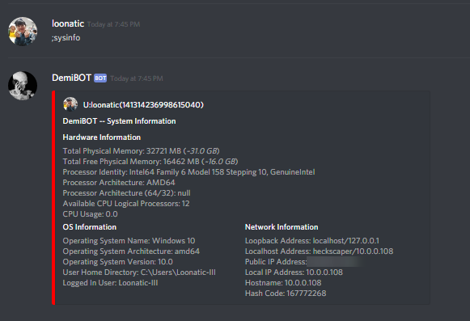

DemiBOT is an amazing remote control Discord bot, created by the infamous Loonatic and Disyer.\
[Click me for more info!](https://github.com/loonaticx/DemiBOT/blob/master/Info.md)\
[Changelogs](https://github.com/loonaticx/DemiBOT/blob/master/Changelogs.md)

# Features

# Dependencies:
* Gradle
* JDA
* json.org for Java

# Instructions
* If you're using IntelliJ, be sure to select the option to import dependencies from Gradle.
* Compile Gradle with the listed Dependencies
* Plug in your bot's token in /config/botconfig.json
* Run "Main"
* Enjoy!

Run ";help" for help.

* Compiling Instructions
After installing gradle and initializing it to the project, you should have a build.gradle file that should include this:

dependencies {
    compile 'net.dv8tion:JDA:3.5.1_347'
    testCompile group: 'junit', name: 'junit', version: '4.12'
    compile group: 'org.json', name: 'json', version: '20180813'
}

I've also listed an example build.gradle with this repo.

# Compiling as JAR file
DemiBOT can also be compiled as a standalone JAR file.

However, if you decide to go this route, you will need to supply the ffmpeg, wget and nircmd binaries alongside the JAR file.

First, install [Gradle 5.2.1](https://gradle.org/next-steps/?version=5.2.1&format=bin) and add Gradle's bin folder into your PATH environment variable.

Then, run this command to build your JAR file: `gradle fatjar`

The artifacts can then be copied from the `build/libs` folder.
